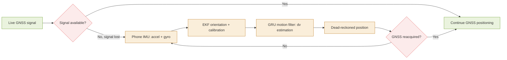
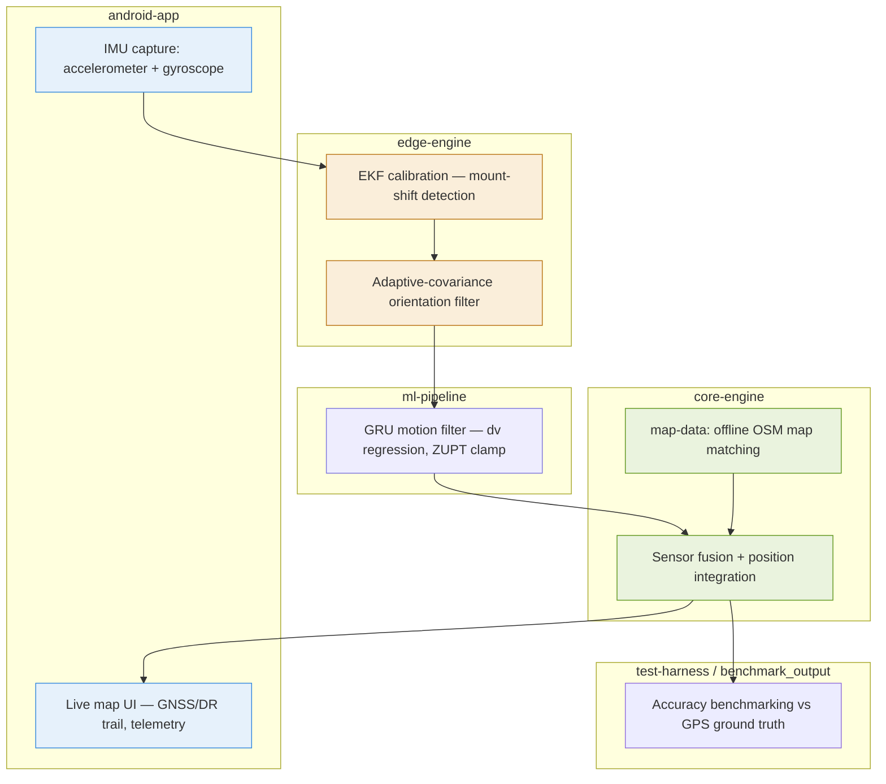

# KAUTILYA — Suraksha Nav

**AI-based Intelligent Dead Reckoning for vehicle navigation during GNSS loss**
Built for Smart India Hackathon — PS 26168 (ISRO)

## Problem

GNSS signal drops or degrades in tunnels, urban canyons, dense forest cover, and jammed
environments. Vehicles depending on GPS lose positioning continuity exactly when they need
it most. Suraksha Nav bridges that gap using only the sensors already inside a smartphone —
no extra hardware.

## Concept

## Architecture

## How it works

1. **Calibration (`edge-engine`)** — static pitch/roll/yaw calibration on drive start, plus a
   continuous 2-state EKF that detects mid-drive phone mount shifts. Orientation trust is scaled
   with an adaptive measurement covariance (not a binary threshold), so sudden braking or
   potholes don't corrupt the tilt estimate.
2. **Motion filtering (`ml-pipeline`)** — a GRU-based model, trained with truncated
   backpropagation through time, predicts velocity change (dv) rather than absolute velocity.
   A dual-head output with a hard zero-velocity-update (ZUPT) clamp prevents drift during
   stationary periods.
3. **Fusion + mapping (`core-engine`)** — filtered motion is integrated into a trajectory and
   matched against offline OSM data in `map-data`, so the app keeps working with no connectivity.
4. **Visualization (`android-app`)** — live map with a GNSS/dead-reckoning trail overlay,
   color-coded: green = live GNSS, amber = dead-reckoning active, red = signal lost / error.

## Dataset

71 verified paired driving sessions (phone IMU + vehicle ground truth), audited and cleaned —
corrupted timestamp sequences repaired, sessions with excessive data loss excluded.

## Repository structure

| Folder | Purpose |
|---|---|
| `android-app` | Prototype Android app — live map, telemetry, drive log, GNSS/DR overlay |
| `edge-engine` | On-device calibration and orientation filtering (EKF) |
| `ml-pipeline` | GRU motion-filtering model — training, labeling, inference |
| `core-engine` | Sensor fusion and trajectory reconstruction |
| `map-data` | Offline OSM data and map-matching logic |
| `test-harness` | Evaluation scripts run against ground-truth sessions |
| `benchmark_output` | Benchmark results and accuracy reports |
| `docs` | Design notes and documentation |
| `scripts` | Utility and pipeline scripts |

## Status

- Calibration and orientation filtering: validated across multiple drivers
- Motion-filtering model: in active development on a cleaned, audited dataset
- Android prototype: core screens in progress

## License

TBD
